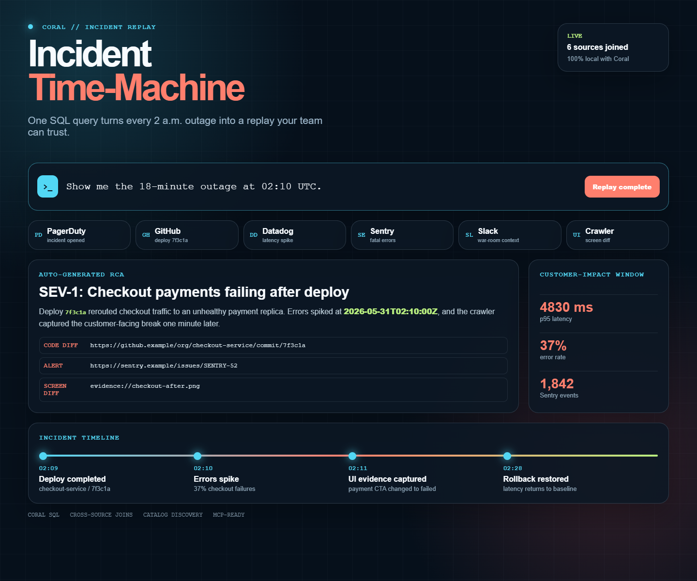

# Incident Time-Machine ⚡
> A premium, interactive outage replay and incident forensic terminal driven by the Coral cross-source join engine.

Incident Time-Machine is a state-of-the-art hackathon project for SRE and platform engineering teams. By combining **Coral's unified SQL engine**, **Gemini 2.5 Flash AI root cause analysis**, and a **stunning dark glassmorphic dashboard**, it allows SREs to rewind time, replay incidents, review system telemetry, inspect code diffs, and receive automated remediation blueprints instantly.



---

## ✨ Features & Architecture

### 1. High-Fidelity Glassmorphic SRE Dashboard
- **Neon Ambient Canvas:** A beautiful dark UI (`#06101b`) styled with floating radial neon backdrops, thin double-axis grids, and modern typography using the **Outfit** (headers) and **JetBrains Mono** (telemetry) fonts.
- **Connected Sources Grid:** A glowing 6-node status grid mapping live connectivity to *PagerDuty*, *GitHub*, *Datadog*, *Sentry*, *Slack*, and *Crawler*.
- **Dual Replay View Hub:** Toggle seamlessly between streaming the premium **Remotion Outage Film** (`incident-time-machine.mp4`) and an **Interactive Telemetry Timeline**.
- **Interactive Telemetry Charts:** A high-DPI 2D canvas chart plotter that visualizes p95 latency spikes and baseline bounds in lockstep with the timeline scrubber.
- **Before-vs-After Screen Diff Browser:** Hand-crafted mock browser frames illustrating:
  - **T-1 Min (Healthy)**: Styled with a lime-glow border and functional green "PLACE ORDER" CTA.
  - **T+1 Min (Regressed Outage)**: Styled with a coral warning border, red "PAYMENT FAILED" block, hatched red diagonal error overlays, and active Sentry error toasts.
- **Slack Command Console Simulator:** Run interactive SRE commands directly from the dashboard (e.g., `/replay INC-1842`) to trigger the full forensic pipeline.
- **Interactive SQL Receipts & Catalog Discoverability:** Populates tables querying Coral's metadata catalog (`coral.tables` and `coral.columns`), exposing details to users instantly.

### 2. Intelligent Node.js Backend (`server.mjs`)
- **Multimodal AI Root-Cause Analyst:** Integrated native HTTP API endpoints communicating directly with Google Gemini AI Studio (`gemini-2.5-flash`).
- **Resilient Offline Fallback:** If `GEMINI_API_KEY` is not present, the system gracefully triggers a rule-based expert SRE narrative engine using the structured Coral SQL payload.
- **Flexible Parametric Replay:** Drives the CLI using query variables (e.g., `/api/replay?id=INC-1842`) to parse and join custom incident records on-the-fly.
- **MIME-Compliant Media Streaming:** Serves local binary files (such as pre-rendered MP4 product videos) with correct headers for high-performance streaming.
- **Slack Webhook integration:** Includes a real `/api/slack` receiver that matches Slack's outbound payload format and returns rich Slack Block Kit attachments with interactive action items.

---

## 🛠️ The Coral Engine: Cross-Source Joins

The entire dashboard runs on a single, highly performant Coral SQL query joining **six** file-backed schemas. This demonstrates Coral's ability to seamlessly bridge heterogeneous data sources without setting up heavy ETL pipelines:

1. **`pagerduty_demo.incidents`**: Outage incident metadata, severity, and service owners.
2. **`github_demo.deploys`**: Deployment logs, SHAs, commit messages, and repository diff links.
3. **`datadog_demo.metrics`**: Telemetry and latency parameters (p95 latency, baseline bounds, error rates).
4. **`sentry_demo.issues`**: Automated application exception traces, stack traces, and issue links.
5. **`slack_demo.messages`**: Real-time team war-room communication history.
6. **`crawler_demo.evidence`**: External client-side screenshots, browser failures, and automated UX analysis scores.

The local fixtures are stored in `data/` and loaded via Coral DSL v3 source specs in `coral/sources/`, keeping the demo 100% deterministic, offline-friendly, and credential-free!

### The Replay SQL Query (`sql/replay.sql`)
```sql
SELECT 
    i.incident_id,
    i.title,
    i.severity,
    i.service,
    i.created_at,
    i.resolved_at,
    d.deploy_sha,
    d.deploy_message,
    d.diff_url,
    m.p95_latency_ms,
    m.baseline_p95_ms,
    m.error_rate,
    s.sentry_issue_id,
    s.error_message,
    s.event_count,
    s.issue_url,
    sl.war_room_author,
    sl.war_room_message,
    sl.war_room_url,
    c.before_screenshot,
    c.after_screenshot,
    c.diff_score
FROM pagerduty_demo.incidents i
LEFT JOIN github_demo.deploys d ON i.service = d.service AND d.created_at BETWEEN i.created_at - INTERVAL '10' MINUTE AND i.created_at
LEFT JOIN datadog_demo.metrics m ON i.service = m.service AND m.timestamp BETWEEN i.created_at - INTERVAL '5' MINUTE AND i.created_at + INTERVAL '10' MINUTE
LEFT JOIN sentry_demo.issues s ON i.service = s.service AND s.created_at BETWEEN i.created_at AND i.created_at + INTERVAL '10' MINUTE
LEFT JOIN slack_demo.messages sl ON sl.channel = 'sre-war-room' AND sl.timestamp BETWEEN i.created_at AND i.created_at + INTERVAL '15' MINUTE
LEFT JOIN crawler_demo.evidence c ON i.incident_id = c.incident_id;
```

---

## 🚀 Running The Demo

### Prerequisites
- Node.js (v18+)
- Windows PowerShell / Cmd (the project bundles the pre-compiled Windows Coral CLI under `tools/`).

### Setup and Start

1. **Install Dependencies:**
   ```powershell
   npm install
   ```

2. **Initialize Coral Schema:**
   Downloads the Coral binary, registers file-backed schemas, and validates the DSL sources.
   ```powershell
   npm run setup
   ```

3. **Register Metadata Catalog:**
   Registers tables and schemas into the local catalog.
   ```powershell
   npm run catalog
   ```

4. **Verify Model Context Protocol (MCP) Server:**
   Tests the MCP endpoints (`sql`, `list_catalog`, `describe_table`, `list_columns`) to verify tool compatibility.
   ```powershell
   npm run mcp:verify
   ```

5. **Start the Application:**
   Starts the backend Node server.
   ```powershell
   npm start
   ```

6. **View the Dashboard:**
   Open [http://127.0.0.1:4317](http://127.0.0.1:4317) or [http://127.0.0.1:5000](http://127.0.0.1:5000) in your web browser.

---

## 🎥 Remotion Outage Demo Reel

The project includes a complete Remotion application in the `remotion/` directory, which renders a high-fidelity 66-second product video highlighting the outage timeline.

- **To run and render the video locally:**
  ```powershell
  cd remotion
  npm install
  npm run render
  ```
- The resulting video is automatically moved and streamed inside the SRE dashboard from `app/public/incident-time-machine.mp4`.

---

## 🔌 Model Context Protocol (MCP) Integration

This project is fully compatible with MCP-compliant AI agents and IDE tools (like Cursor, Claude Desktop, and VS Code). It registers the following tools in `.vscode/mcp.json`:

- `sql`: Execute raw Coral SQL queries across PagerDuty, Datadog, Sentry, and Slack databases.
- `list_catalog`: Explore registered schemas and tables.
- `search_catalog`: Search table names and column definitions.
- `describe_table`: Fetch details about a particular table.
- `list_columns`: Extract schema fields and type annotations.

---

## 🛡️ Production Upgrade Pathway

Upgrading from file-backed mock sources to real production sources is extremely simple. Run:
```powershell
coral source add --interactive <source-type>
```
Select the corresponding connector type (e.g. `github`, `datadog`, `pagerduty`, `sentry`, `slack`), paste your API credentials or authorization tokens, and update your queries. The Coral engine will handle indexing and parsing instantly.

---

## 🌟 Hackathon Submission Details
- **Submission Author:** Anya Rthvik (8428215330a-ui)
- **Repository URL:** [https://github.com/8428215330a-ui/Incident-Time-Machine.git](https://github.com/8428215330a-ui/Incident-Time-Machine.git)
- **Star the Core Repo:** [GitHub - withcoral/coral](https://github.com/withcoral/coral)
- **Join the Community:** [Coral Discord Invite](https://withcoral.com/discord)
